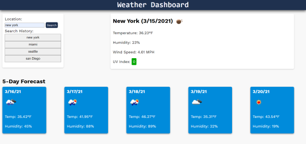

# WeatherDashboard

[Live App](https://chopsushi206.github.io/WeatherDashboard/)

## Acceptance Criteria

```
GIVEN a weather dashboard with form inputs
WHEN I search for a city
THEN I am presented with current and future conditions for that city and that city is added to the search history
WHEN I view current weather conditions for that city
THEN I am presented with the city name, the date, an icon representation of weather conditions, the temperature, the humidity, the wind speed, and the UV index
WHEN I view the UV index
THEN I am presented with a color that indicates whether the conditions are favorable, moderate, or severe
WHEN I view future weather conditions for that city
THEN I am presented with a 5-day forecast that displays the date, an icon representation of weather conditions, the temperature, and the humidity
WHEN I click on a city in the search history
THEN I am again presented with current and future conditions for that city
```

## Development

Started assignment by creating a repository and file structure for the App, and did a commit with boiler plate HTML and css resets. Then began constructing the basic HTML elements and CSS that would be required. 

Then started on the javascript portion of the page by first pulling the fetch data and using the console to make sure correct data fields were selected with dot notation. using that, varaibles were created to make elements within the javascript and append them to existing dom elements, with the fetch data applied as the text content. 

Once the daily forcast was hard coded,another fetch was created within that, using the data from the fetch to plug in latitude and longitude needed for another fetch to get the UV index information. that was also plugged into an element and appended to the page, the biggest change being the addition of an if else statement that added classes depending on the value of the UV data. 

After that the section for the 5 day forecast was also created,using the same approach as the daily forecast, the only difference being the addition of a foreach loop to create an element, at text content, and append to dom element for each of the objects within the array that had been selected. 

Then it was necessary to write a function onbtaining the value of the text input in the html when the user clicks the submit button. This was done with an event listener, and also called the fetch functions on click, that way an argument with the value of the text area could be added into each function, allowing that value to be plugged into the fetch address. Also added a few classes to dom elements so that forecasts are not visible until user submits a search. that value is also pushed into an array to store all the cities the user has searched for previously.

The last step was to add a function using the Array stored in local storage with all the previous searches. the buttons are rendered based on the last 5 instances pushed into the array, and then call the  fetch functions once with an event listener on the button again using the current value of the array as an argument passed into those functions to be put into the fetch url. With that, assignment and requirements were completed. 

## Screenshots



---

## Developer


 Coding and repository done by [Li Hua Anderson](https://github.com/chopsushi206).

[Email](mailto:lihua.anderson@gmail.com) | [LinkedIn](https://linkedin.com/in/li-hua-anderson-b259b7144)
